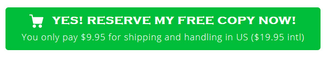

# Svelte - Gumroad Buy Button

---

## Consuming this component

Import this component directly using your bundler plugin like [rollup-plugin-svelte](https://github.com/sveltejs/rollup-plugin-svelte) or [svelte-loader](https://github.com/sveltejs/svelte-loader) (where [`resolve.mainFields`](https://webpack.js.org/configuration/resolve/#resolve-mainfields) in your webpack config includes `"svelte"`). 
